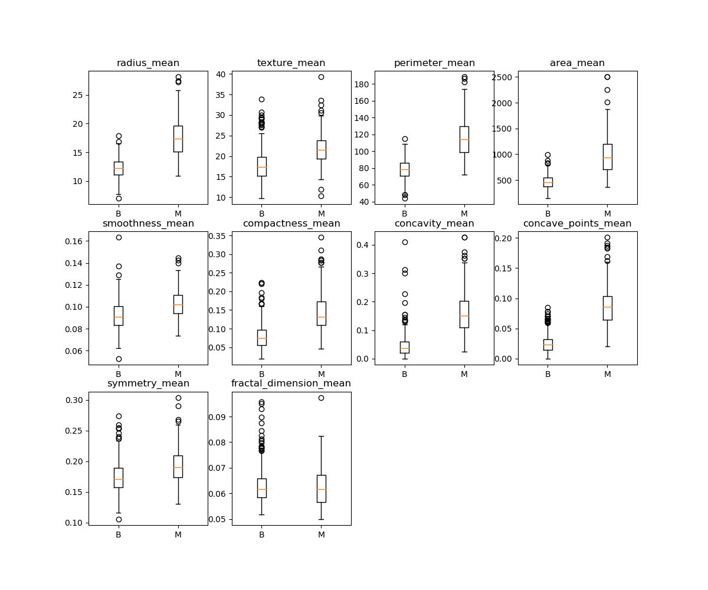
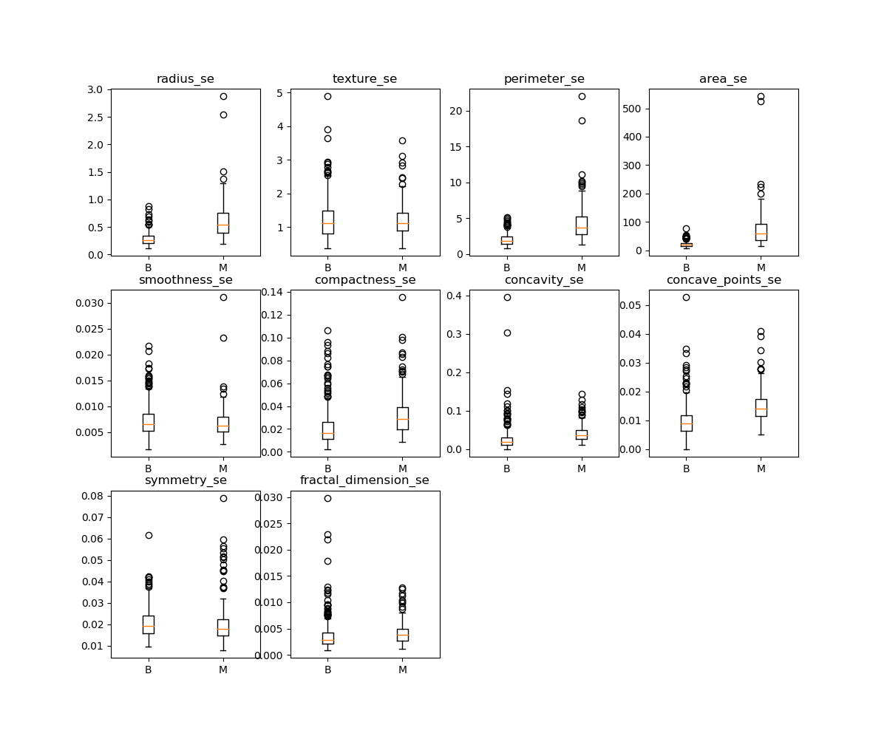
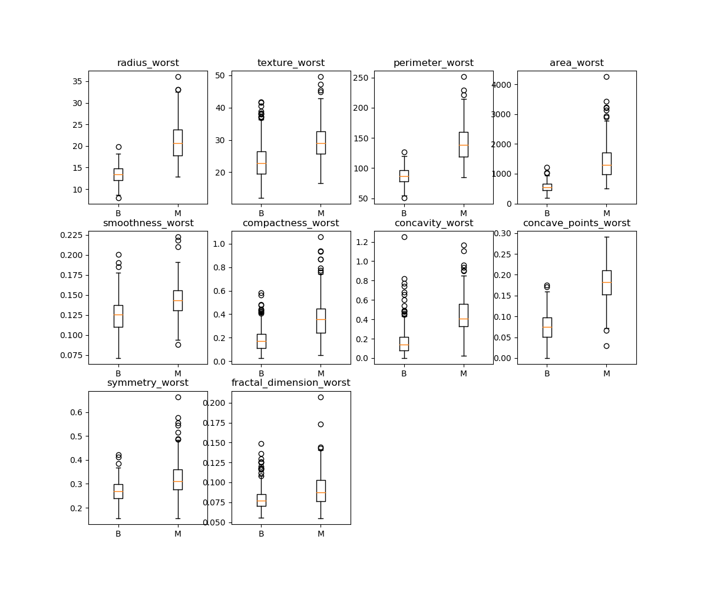
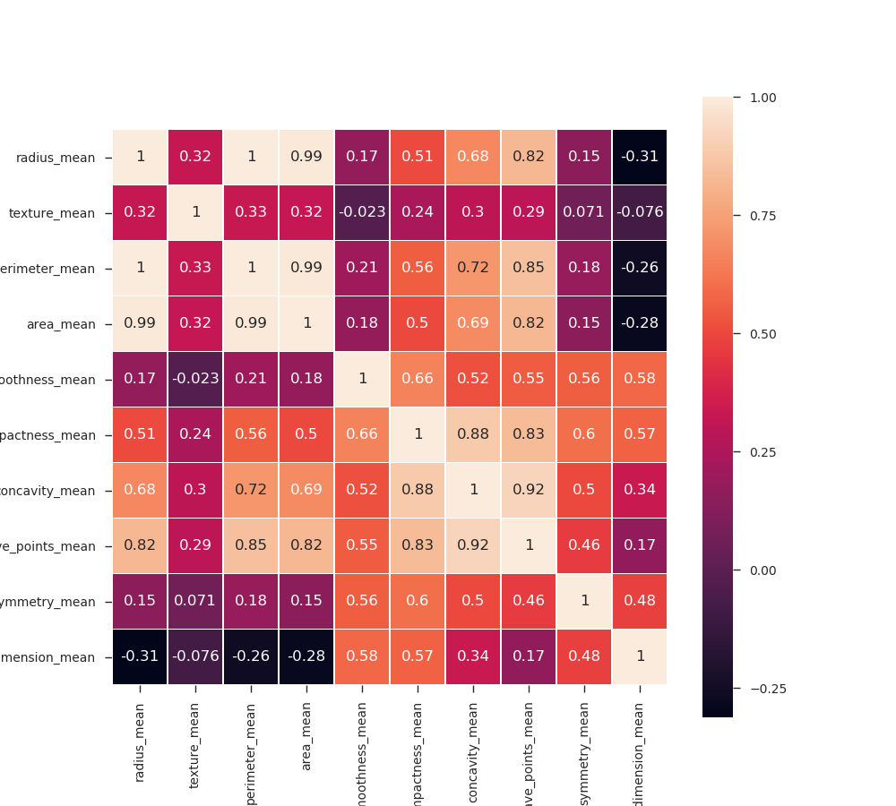
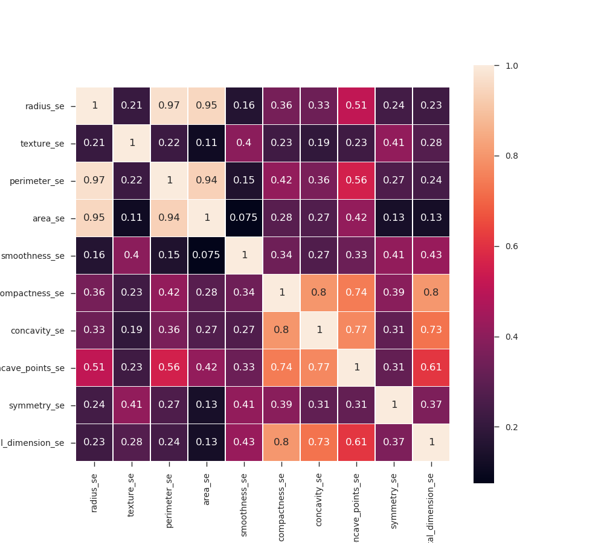
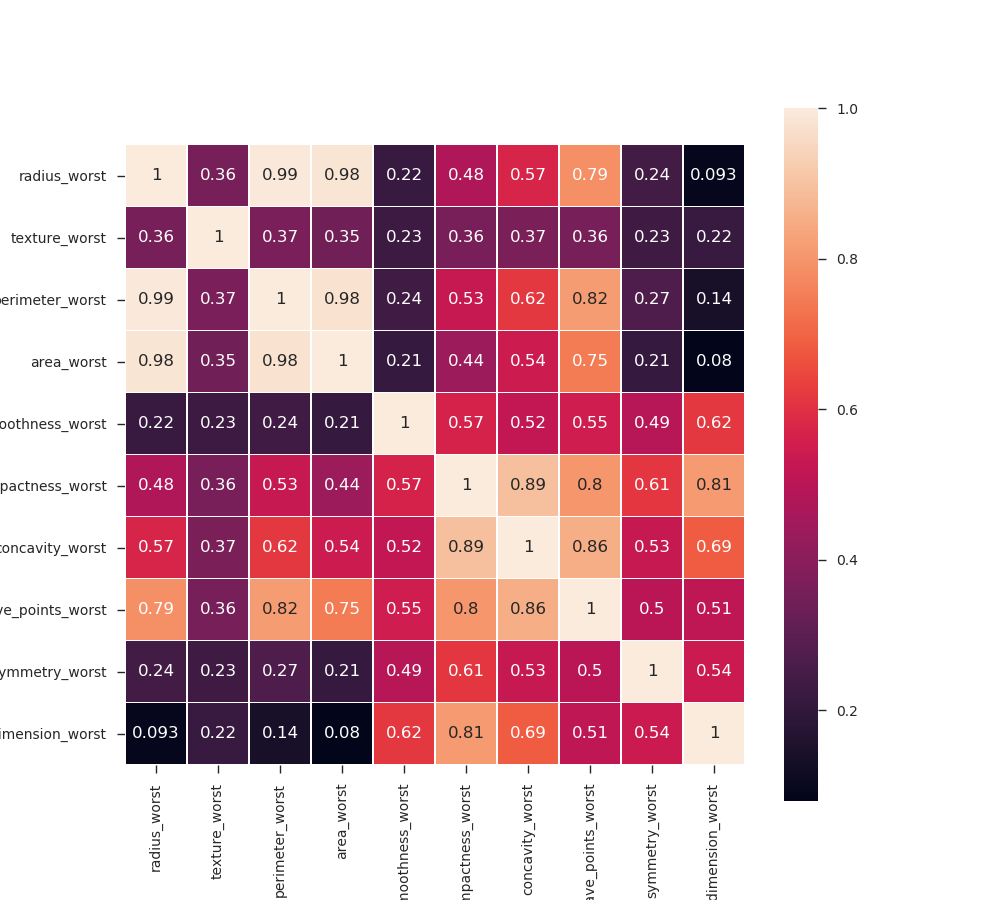
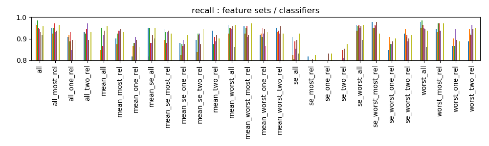
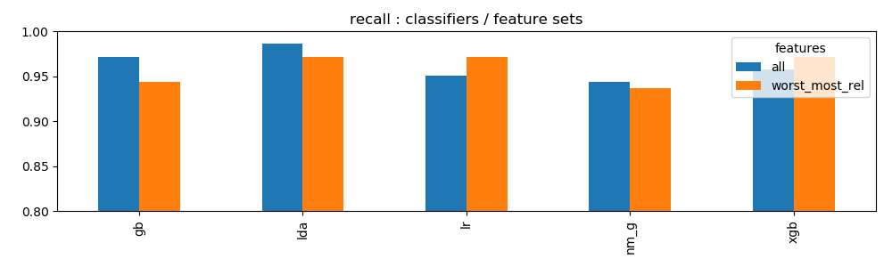
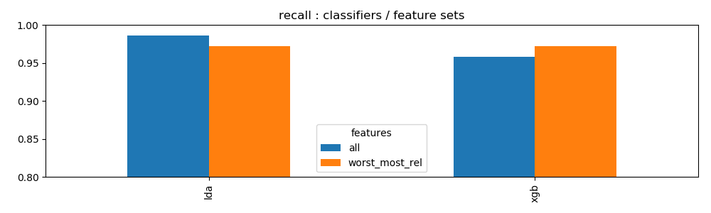

# Analyse der Daten aud bc-daten.csv

Folgende Tasks sollen in Python durchgeführt werden:

* komplette EDA des Datasets (mit Visualisierung)
    * wieviele NA sind vorhanden?
    * Falls NA vorhanden sind sollen diese ersetzt werden
    * Finden der für die Prediction am Besten geeigneten Features
    * Aufbau folgender Modelle (mit Angabe von rsquared, precision, recall, f1)
        * Linear Regression
        * Logistic Regression
        * LDA
        * SVM
        * knn
        * Naive Bayes
        * Random Forrest
        * XGBoost
    * Confusion Matrix pro Modell
    * Wahl des besten Modells

## Attribute Information:

* ID number 
* Diagnosis (M = malignant, B = benign) 3-32)

Ten real-valued features are computed for each cell nucleus:

* radius (mean of distances from center to points on the perimeter) 
* texture (standard deviation of gray-scale values) 
* perimeter 
* area 
* smoothness (local variation in radius lengths) 
* compactness (perimeter^2 / area - 1.0) 
* concavity (severity of concave portions of the contour)
* concave points (number of concave portions of the contour) 
* symmetry 
* fractal dimension ("coastline approximation" - 1)

The mean, standard error and "worst" or largest (mean of the three largest values) 
of these features were computed for each image, resulting in 30 features. For instance, 
field 3 is Mean Radius, field 13 is Radius SE, field 23 is Worst Radius.

All feature values are recoded with four significant digits.

Class distribution: 357 benign, 212 malignant

## Analyse

Anzahl der Datensätze: 569

357 benign B

212 malignant M 

### Wieviele NA sind vorhanden ?
Es gibt keine Nullwerte. Details siehe _py/analyse_na.py_.

### Falls NA vorhanden sind sollen diese ersetzt werden ?
Falls NAs vorhanden wären könnten:
* Die entsprechenden Zeilen entfernt werden. Nachteil: Es sind nur wenig Testdaten vorhanden. Sollen wir da noch ganze Zeilen löschen ?
* Entsprechende Werte durch den Mittelwert der betroffnen Spalte ersetzt werden.

### Finden der für die Prediction am Besten geeigneten Features
####Analysiere die Einzelnen Features in Abhängigkeit zur Klassifizeirung.





Folgende Attribute zeigen eine ausgeprägte Abhängigkeit von der Diagnose
* radius
* perimiter
* area
* compactness
* concavity
* concave_points


Folgende Attribute zeigen eine mittlere Abhängigkeit von der Diagnose
* texture

Folgende Attribute zeigen eine geringe Abhängigkeit von der Diagnose
* smoothness
* symmetry
* fractal_dimension

Generell ist die Abhängigkeit bei der Gruppe 'worst' und 'mean' ausgeprägter als bei 'se'.

#### Abhängigkeiten der Features untereinander




Auffällig (aber nicht weiter verwunderlich) ist die Korrelation zwischen radius, permiter und area.

Weiters scheint ein Zusammenhang zwischen compactness und concavity zu bestehen.

### Aufbau folgender Modelle (mit Angabe von rsquared, precision, recall, f1)
* rsquared macht wenig Sinn für Classification Problem
#### Linear Regression
Macht wenig Sinn
#### Vergleich Classifiers

Verwendete Technologie: sklearn, xgboost

Classifier: 
* LDA 
* SVM
* knn
* Naive Bayes (nm_g)
* Random Forrest (rf)
* XGBoost (xgb, gb)

Die Classifier wurden gegen eine Auswahl von Features (Feature Sets) getestet. 
* all: Alle 
* se_all: Alle der Gruppe Standard Error (se)
* se_two_rel: Aus der Gruppe se zwei Relevante (radius, concavity) 
* worst_most_relevant: Aus der Gruppe worst alle Relevanten (radius, texture, compactness, concavity, concave_points) 

Zur Auswahl des Classifiers wurde die Metrik 'recall' verwendet.



Der Vergleich der Feature Sets zeigt die besten Recall-Werte für 'all' und 'worst_most_rel'. 
Diese beiden Feature-Sets zeigen etwa gleiche Performance, obwohl si sich stark in der Anzahl der Features 
unterscheiden.


Der vergleich der Classifier zeigt ähnliches Verhalten für alle Classifier ausser SVM.



Der Vergleich der besten Classifier mit den wirkungsvollsten Feature-Sets zeigt annähernd gleiche Performane. xgb, gb 
und lda sind den übrigen leicht überlegen.

Eine genauere Analyse mit einer Optimierung diverser Metaparameter sollte für diese drei Classifier durchgeführt werden.

Falls möglich sollte die Anzahl der Trainingsdaten erhöht werden. 

#### Vergleich der Metriken

Verwendete Metriken
* recall
* precission
* f1




Der Vergleich der Metriken zeigt annähernd gleiche Werte für alle Metriken. 


## Install XGBoost
 
```
git clone --recursive https://github.com/dmlc/xgboost
cd xgboost
make -j4
 
cd in the folder: xgboost/python-package
 
python setup.py install
```
 
 
### Install libgcc
 
```
conda install libgcc
```
 
Go to python shell and type:
 
```
import xgboost as xgb
```
